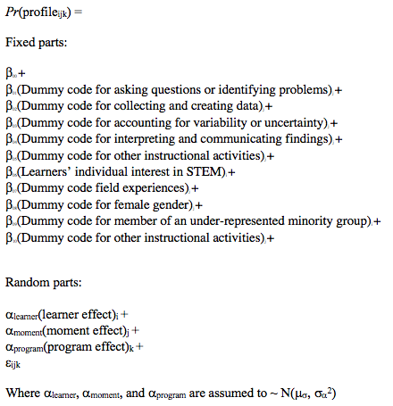

```{r, setup-method-fix, include=FALSE}
knitr::opts_chunk$set(echo = FALSE, 
                      message = FALSE, 
                      warning = FALSE, 
                      collapse = TRUE,
                      fig.width = 6,
                      fig.asp = .618,
                      out.width = "80%", 
                      fig.align = "center", 
                      results = "hold") 
```

# Method

This is a causal comparative study, in that explanations for differences in PECs are sought after their occurrence. This study uses ESM (Hektner et al., 2007) data collected as part of a study of learners’ interest and engagement in outside-of-school STEM enrichment programs (Shumow & Schmidt, 2013). It makes use of a sequential exploratory data analysis strategy, in which qualitative data is analyzed to enrich quantitative findings (Creswell, Clark, Gutmann, & Hanson, 2003). In particular, moments in which learners are particularly engaged are identified as part of the quantitative analysis; these moments are then coded qualitatively to identify their common characteristics, first through an inductive step and then through a confirmatory step involving a second rater. While programs have been video-recorded, the video has not been coded for the aspects of work with data, and the other measures from ESM and pre-survey data are to be constructed for this study. 

## Participants

Participants will consist of 203 youth. Students in these programs are from diverse racial and ethnic backgrounds. Most participants are around 13 years old (from students whose age was available: M = 12.71, SD = 1.70, min. = 10.75, max. = 16.36). Detailed demographic characteristics of learners are presented in Table 1.

**Table 1
Demographic Characteristics of Learners**

```{r, eval = T}
d <- tibble::tribble(
  ~Students, ~Percentage,
  "Sex",          NA,
  "Male",         50L,
  "Female",         50L,
  "Race/Ethnicity",          NA,
  "Hispanic",         48L,
  "White",          6L,
  "Black",         36L,
  "Multi-racial",          3L,
  "Asian/Pacific Islander",          7L,
  "Parent Education",          NA,
  "High School or Below",         79L,
  "Graduated from College (B.A. or B.S.)",         21L
)

d %>% 
  kable(booktabs = TRUE)
```

## Context	

The setting for this study will be nine out-of-school STEM programs designed around best practices in urban areas in the Northeast United States during the summer of 2015. These are described in Table 2 with pseudonyms for the program names. 

**Table 2 
STEM Enrichment Program Names and Their Descriptions**

```{r}
d <- tibble::tribble(
  ~Program.Name,                                                                                                                                                                                                                                                                                                                                                                                                                                                                                                                                                                                                                                                                                                                                                                                                                                                                                                                                                                                                                                                         ~Program.Description,
  "Island Explorers",                                                                                                                                                                                  "A science-focused program that aims to help youth develop expertise on one species found in the local ecosystem by reading and writing about related content for up to an hour per day; undertaking data collection and analysis tasks to learn about the local ecosystem and how to communicate scientific data; developing vocabulary about the local ecosystem; using art to learn and communicate information; and publishing a book illustrating important elements of the species being studied. Located in both the classroom and local ecosystem. 27 students who are rising 6th graders. Youth spend the morning in more academically-oriented sessions in a classroom setting, while afternoon sessions involved STEM-oriented enrichment sessions taking place outside (the program was associated with Outward Bound) with an emphasis on exploration of the local ecosystem.",
  "The Ecosphere",                                                                                                                                                                                                                                                                       "A science-focused program that aims to help youth to explore the marine life of Narragansett Bay. Efforts were undertaken to build youth content knowledge in the areas of ecosystem preservation, marine biology, and water quality, and related skills, such as questioning, showing initiative, data collection, measuring, maintaining an ecosystem, and analyzing water samples. Located in a classroom setting, shoreline, and science education center. 27 youth who are rising 6th to 9th graders. Youth attended programming in a classroom at an area middle school and in a field-based setting on alternating days. Field-based settings included a science education center at a community-based organization and field trips to sites in the community related to the program's focus.",
  NA,                                                                                                                                                                                                                                                                                                                                                                                                                                                                                                                                                                                                                                                                                                                                                                                                                                                                                                                                                                                                                                                                           NA,
  "Zoology Partners",                                                                                                                                                                                                                                                                                                                               "A science-focused program that aims to support youth's development of content knowledge related to the issue of endangered species, including how species become endangered, processes for monitoring ecosystem viability and population levels, solutions to prevent species from becoming endangered, and approaches to reviving populations that are currently endangered. Located in the classroom as well as zoos, parks, and other natural areas. 25 youth who are rising 6th to 9th graders. Youth attended programming in a classroom at an area middle school and in a field-based setting on alternating days. Field-based settings included a local zoo and field trips to sites in the community related to the program's focus.",
  "Marine Investigators",  "A science-focused program that aims to provide youth with opportunities to learn about and experience Narragansett Bay; examine human impacts on the local ecosystem, including how the geography of the Bay helped influence human history and how the history of humans along the shoreline has impacted the Bay, and begin the process of cultivating a sense of stewardship among participating youth for caring for and protecting the Bay in the future. Located in the classroom, shoreline along the bay, ship on the bay, and various field locations associated with bay health. 19 youth who are rising 7th to 9th graders. Youth attended programming in a classroom at an area middle school and in a field-based setting on alternating days. Field-based settings included the local bay shoreline, a voyage on a marine education ship researching in the Bay, and field trips to sites in the community related to the program's focus. During the span of the program, youth had the opportunity to participate in both a water quality research study.",
  "Comunidad de Aprendizaje",                                                                                                                                                                                                                                                                                                                                                                                                        "A STEM-focused program that aims to help youth improve basic skills in mathematics and develop an interest in STEM content and entrepreneurship. Primarily in the classroom setting. 33 students who are rising 5th to 8th graders. Morning sessions are characterized by direct instruction in mathematics for individual grade levels and mixed grade level afternoon enrichment sessions in either robotics or dance. The direct instruction component of the programs was organized around a theme of promoting entrepreneurship with the goal of helping participating youth better see the relevance of mathematics to future career goals and opportunities.",
  "Jefferson House",                                                                                                                                                                                                                                                                                                                             "A STEM-focused program that aims to support youth's development of basic math skills, the program was primarily focused on helping youth develop problem solving, self-improvement, and critical thinking skills. Located in a classroom. 11 youth who are rising 7th graders. The youth spent the morning in more academically-oriented sessions in a classroom setting focusing on basic skill development, while afternoon sessions involved STEM-oriented enrichment sessions involving media, art, and nutrition. Enrichment offerings varied by day, with math sessions occurring twice per week, alternating with academically oriented sessions in the am that were oriented at supporting skill development in English/language arts.",
  NA,                                                                                                                                                                                                                                                                                                                                                                                                                                                                                                                                                                                                                                                                                                                                                                                                                                                                                                                                                                                                                                                                           NA,
  "Uptown Architecture",                                                                                                                                                                                                                                                                                  "An engineering-focused program that aims to support youth's participation in a process to design and build an outdoor learning space for use at the middle school where the program was housed. A key focus of the program was to provide youth with the opportunity to use design thinking as a problem-solving tool and have the experience of affecting their community positively through the design/build process. Located in a classroom, building shop, and various field locations. 18 youth who were rising 6th to 9th graders. Youth attended programming in a classroom at an area middle school and in a building shop located at a community-based organization on alternating days, while also taking field trips to locations associated with the program's overall theme.",
  "Building Mania",                                                                                                                                                                                                                                                                         "An engineering-focused program that aims to provide youth with the opportunity to experiment with designing and using simple machines. A goal of the program is to have youth engage in the engineering design process by determining a need, brainstorming possible designs, selecting a design, planning and drawing out the design, creating and testing and revising it, and producing a final machine. Located in the classroom, design labs, and other local locations. 24 youth who are rising 6th to 9th graders. Youth attended programming in a classroom at an area middle school and a field-based setting on alternating days. Field-based settings included a design lab at a community-based organization and field trips to sites in the community related to the program's focus.",
  "Adventures in Mathematics",                                                                                                                                                                                                                                                                                                                                                                                                                                                                                                                                                                                             "A mathematics-focused program that aims to help youth to develop the basic math skills and prevent summer learning loss among participating youth through direct instruction and participation in math-related games. Located primarily in the classroom. 20 youth who are rising 8th to 10th graders. Youth participated in direct instructions in mathematics and math-related games in small groups. Program content was aligned with the state's standards in mathematics."
)

d %>% 
  knitr::kable(booktabs = TRUE)
```

Two intermediary organizations contracted by the urban area school districts to administer the summer programs. The two intermediaries were responsible for soliciting and enrolling youth; establishing guidelines for the design of the programs, and the goals of the programs; and provide training and professional development for the program’s staff. A key difference between the intermediary organizations was that one separated academic and enrichment-related activities, whereas, in another, which was more closely involved in the day-to-day activities of the program, the academic and enrichment components were more integrated, which may have program-specific effects on learners’ engagement. Many of the programs aim to involve learners in work with data. These learning environments bring together youth activity leaders, educators, and those with technical expertise in STEM domains. Students spent around three hours per day for four days per week for the approximately four-week programs, which were taught by youth activity leaders and scientists, engineers, and other community members with technical expertise. 

## Procedure

Students completed a pre-survey before the program. Students also completed pre- and post-course surveys of their experience in STEM, intention to pursue a STEM major or career, and questions for other motivation and engagement-related measures. At the beginning of the programs, students were introduced to the study and the phones used for data collection related to the ESM. ESM data were collected two days each week, for three weeks (weeks 2-4 of the program). In all of the programs, about equal video-recording time was dedicated to classroom and field experiences. This detail is important because programs associated with one of the intermediaries rotated between classroom and field experience days, while the other used the first half of each day for one (i.e., classroom activities) or the other (i.e., field experience days). 

Each day, students were signaled four times. These signals were at the same time for all of the students within their program, but at different times between programs and between days within programs (with the constraint that no two signals could occur less than ten minutes apart). All of the programs were video-recorded by research team members and on three occasions research team members who recorded detailed field notes on the nature of program activities. So that measures corresponding to the video and ESM data can be matched, videos include a signal from the video-recorder identifying the ESM signal to which students responded at that point in the video. 

In a reflection of the dynamic conceptualization of engagement, this study uses data collected from ESM. As such, learners are prompted at regular intervals to respond to short questions about their perceptions of their engagement and its influencers. Though time-consuming to carry out, ESM can be a powerful measure that leverages the benefits of both observational and self-report measures, allowing for some ecological validity and the use of closed-form questionnaires amenable to quantitative analysis (Csikszentmihalyi & Larson, 1987). Despite the logistic challenge of carrying out ESM in large studies, some scholars have referred to it as the “gold standard” for understanding individual’s subjective experience (Schwarz, Kahneman, & Xu, 2009). This approach has the benefit of measuring learners’ engagement at a fine grain-size: Changes in the activity on learners’ engagement, even within the same session of the program, and changes in how influencers of engagement impact engagement and how the activity may relate to engagement, can be measured. 

## Data Sources and Measures

Data sources will consist of self-reported ESM measures of engagement and learners’ perceptions of themselves and the activity, pre-survey measures of students’ interest, students’ demographic information, and video-recordings of programs. 

ESM measures of learners’ engagement and its conditions. Measures for engagement and its conditions will be constructed from three ESM responses for engagement and two ESM responses for the conditions of engagement. The three variables for engagement are for learning (for the cognitive engagement construct), working hard (for behavioral engagement), and enjoying (for affective engagement). The variables for the conditions are for perceived challenge and perceived competence. All five items will be used to construct PECs. Each of the ESM items consisted of the item text and the following four item response options, of which students were directed to select one: Not at all (associated with the number 1 on the survey), A little (2), Somewhat (3), and Very Much (4), as presented in Table 3. 

**Table 3
ESM measures for profiles of engagement and its conditions (PECs)** 

```{r}
d <- tibble::tribble(
               ~Construct,                                                                         ~Item.text,
   "Cognitive engagement", "As you were signaled, were you learning anything or getting better at something?",
  "Behavioral engagement",                                 "As you were signaled, how hard were you working?",
   "Affective engagement",                          "As you were signaled, did you enjoy what you are doing?",
    "Perceived challenge",                     "As you were signaled, how challenging was the main activity?",
   "Perceived competence",                        "As you were signaled, were you good at the main activity?"
  )

d %>% knitr::kable(booktabs = TRUE)
```

Survey measures of pre-interest. Measures of students’ pre-interest are used as student-level influencers of PECs. In particular, three items adapted from Vandell, Hall, O’Cadiz, and Karsh (2012) were used, with directions for students to rate their agreement with the items’ text using the same scale as the ESM items: Not at all (associated with the number 1 on the survey), A little (2), Somewhat (3), and Very Much (4). The items are presented in Table 4.

**Table 4
Survey Measure Used in This Study**


```{r}
d <- tibble::tribble(
                     ~Construct,                                                            ~`Items.text`,
  "Individual interest in STEM",               "I am interested in science / mathematics / engineering.",
                             NA,                 "At school, science / mathematics / engineering is fun",
                             NA, "I have always been fascinated by science / mathematics / engineering)"
  )

d %>% knitr::kable(booktabs = TRUE)
```

Codes for the activity from the video-recordings. Different aspects of work with data will be identified from video-recordings with the use of a coding frame with seven codes: five for each of the aspects of work with data and the remaining two codes are for other instructional activities, such as listening to a youth activity leader or completing a worksheet, in order to compare work with data to other activities which are potentially engaging but not oriented toward work with data, and one for other activities, such as traveling between program sites or the time in between activities. These codes are summarized in Table 5.

<!-- Revised Proposed Plan -->
<!-- ●	First, use video codes for Work With Data in place of the coding frame I developed from the STEM-Program Quality Assessment (STEM-PQA; Forum for Youth Investment, 2012), an assessment of quality programming in after school programs  -->
<!-- ○	This coding frame aligns closely with the original coding frame for Work With Data that I proposed, particularly the codes for STEM Skill-building, although there are some differences (described in the table at the end of this document) -->
<!-- ○	Each segment is coded with a 1 (present) or 0 (not present) for each of the codes for STEM Skill-building. -->
<!-- ○	The STEM-PQA instrument was adapted from the overall PQA instrument (see Smith et al., 2012). In particular: -->
<!-- ■	The items for STEM skill-building (and another set of codes for self-transcendent-goals) were added to the PQA -->
<!-- ■	A dichotomous scoring approach (observed or not observed) was used -->
<!-- ○	Reliability of the raters' use of the overall PQA instrument and the STEM-PQA was established, though the process of establishing reliability for the PQA was more in-depth than for the STEM-PQA (described in the notes below). -->
<!-- ○	Second, use a qualitative approach for the same reasons described in the initial plan - understand quantitative findings that are of particular interest or findings that are discrepant (with other findings or with the study's hypotheses), for example: -->
<!-- ■	Describe the characteristics of aspects of work with data, such as generating data or modeling and analyzing data, to better understand how they are carried out in these out of school STEM programs -->
<!-- ■	Document other characteristics of highly engaging (or disengaging) signals, such as being focused on phenomena, associated with an activity that is sustained over time, and collaborative -->
<!-- ■	Investigate in greater detail findings, such as relationships between the aspects of work with data and the profiles of engagement and its conditions that are of particular interest (such as the relationship between data modeling and one of the profiles) or findings that are discrepant and in need of further investigation in order to be understood better.  -->

References
Forum for Youth Investment. (2012). Youth Program Quality Assessment. Washington, DC: The Forum for Youth Investment
Smith, C., Akiva, T., Sugar, S., Lo, Y. J., Frank, K. A., Peck, S. C., Cortina, K. S., & Devaney, T. (2012).Continuous quality improvement in afterschool settings: Impact findings from the Youth Program Quality Intervention study. Washington, DC: The Forum for Youth Investment. 

**Table 5 Coding Frame for Work With Data**

```{r}
d <- tibble::tribble(
                ~Aspect.of.Work.With.Data,            ~Code,
  "Asking questions or defining problems", "0: Not present",
                                       NA,     "1: present",
                    "Making observations", "0: Not present",
                                       NA,     "1: present",
                        "Generating data", "0: Not present",
                                       NA,     "1: present",
                          "Data modeling", "0: Not present",
                                       NA,     "1: present"
  )

d %>% knitr::kable(booktabs = TRUE)
```

To determine the potential viability of this coding frame, observational notes from trained observers were analyzed. There were at least three observations for each of the nine programs. While these observation notes were collected only on a small number of days, video recordings of the programs (analyzed in the present study) were much more comprehensive. 31 observation notes were collected in total. A coding framework for work with data with three levels was used: 0 (no evidence of work with data), 1 (some evidence of work with data), and 3 (evidence of work with data). This analysis demonstrated that 36.6 % of notes revealed no evidence of work with data, 40 % of notes revealed some / potential evidence of work with data, and 23.3% revealed evidence of work with data.

In addition to the codes for aspects of work with data, all of the video are also coded as occurring in the classroom or in a field setting. These codes were created by research team members on the basis of documentation from the intermediary program providers, who alternated between classroom and field experiences on the basis of a set schedule. Furthermore, the videos are also coded regarding the instructional leader support for STEM-related practices created through the use of the Program Quality Assessment (Akiva, 2005). Accordingly, codes for instructional leader support for STEM practice to correspond to the codes for work with data will be created. These codes will equal to 1 only when both the aspect of work with data (in Table 5) is present as is the PQA code(s) associated with that aspect of work with data; accordingly, these codes will represent students’ engagement in aspects of work with data that are also observed to be supported by youth instructional leaders. These codes are presented in Table 6.

```{r}
d <- tibble::tribble(
  ~`Work with data codes`,                                                                                                    ~Description,                                                                                                                                                                                                                                                                                                                                                        ~`Categories from STEM-PQA`,
  "Asking questions or defining problems",                                            "Discussing and exploring topics to investigate and pose questions.",                                                   "Predict, conjecture, or hypothesize (Staff support youth in using a simulation, experiment, or model to answer questions, explore solutions, or test hypotheses (e.g., Youth run a robotics program to determine whetherit does what they expect it to; Youth try an alternate way to solve an equation and test their results against another example, etc.))",
  "Making observations",          "Watching and noticing what is happening with respect to the phenomena or problem being investigated.",                                                                        "Classify or abstract (Staff support youth in using classification and abstraction, linking concrete examples to principles, laws, categories, and formulas (e.g., Mice, porcupines, and squirrels are all rodents, rodents are all mammals; The pool ball moved because for every action, there is an equal and opposite reaction; etc.))",
  "Generating data", "Figuring out how or why to inscribe an observation as data and generating coding frames or measurement tools.",                                                                                                                                                                               "Collect data or measure (Staff support youth in collecting data or measuring (e.g., Youth use rulers or yardsticks to measure length; Youth count the number of different species of birds observed in a specific location, etc.))",
  NA,                                                                                                              NA, "Highlight precision and accuracy (Staff highlight value of precision and accuracy in measuring, observing, recording, or calculating (e.g., measurement error can impact an experiment or conclusion; measure twice, cut once; scientist always need to double-check their claculations before drawing conclusions; you must observe carefully to see the difference between various species of sparrows, etc.))",
  "Data modeling",  "Understanding and explaining phenomena using models of the data that account for variability or uncertainty.",                                                       "Simulate, experiment, or model (Staff support youth in using a simulation, experiment, or model to answer questions, explore solutions, or test hypotheses (e.g., Youth run a robotics program to determine whether it does what they expect it to; Youth try an alternate way to solve an equation and test their results against another example, etc.))",
  "Interpreting and communicating findings",                                                               "Discussing and sharing and presenting findings.",                                                                                                                                                                                               "Analyze (Staff support youth in analyzing data to draw conclusions (e.g., after an experiment, youth are asked to use results to make a generalization like \"Your heartbeat increases when you exercise\", etc.))"
)


d %>% knitr::kable()
```

Demographic variables. In addition to the measures described in this section, demographic information for youths’ gender and their racial and ethnic group will be used to construct demographic variables for gender and membership in an under-represented (in STEM) group; membership in an under-represented group will be identified on the basis of students’ racial and ethnic group being Hispanic, African American, Asian or Pacific Islanders, or native American. 

## Data Analysis

Before analyzing data to answer the research questions, preliminary analyses will be carried out. The steps for both preliminary and the primary analyses are described in this section.

Preliminary analyses. Codes for the aspects of work with data will be created from coding videos of the activity occurring immediately before learners were signaled to respond to a survey as part of the ESM. Before one rater independently codes the video associated with all of the signals, inter-rater reliability between the primary and a secondary rater will be established. The coding frame in Table 5 will be used to code a random sample of the videos associated with 30 of the ESM responses. The coding frame will be used to code for the presence of one and only one of the codes for the aspects of work with data. The agreement between the original and second rater will be calculated using Fleiss’ kappa, with a value above .70 indicating satisfactory agreement. If the disagreement is not satisfactory, then cases in which the raters disagreed will be discussed and resolved, and a different sample of videos associated with ESM responses will be coded again. Following the satisfactory agreement, all of the videos associated with ESM signals will be coded independently: In order to provide to the coder the context to the video segments to be coded, all of the video segments will be viewed (but only those associated with ESM signals will be coded).

First-order Pearson correlations, frequency, range, mean, skew, kurtosis, and standard deviations will be examined for all variables including ESM measures for challenge, competence, cognitive, behavioral and affective engagement, and for the pre-survey measure for interest. In addition, the frequency of the codes for aspects of work with data, and the number of responses by student, program, and moment will be examined.

Primary analyses for RQ #1. To answer this question, PECs will be constructed using on the basis of five variables: cognitive, behavioral, and affective engagement and learners’ perceptions of challenge and competence. Answers to this question will help to understand how the aspects of engagement relate to both one another and to key conditions that influence engagement. 

To create PECs, a mixture modeling approach will be carried out. Mixture modeling is an approach for identifying distinct distributions, or mixtures of distributions, of measured variables. A type of mixture modeling within a latent variable modeling framework, Latent Profile Analysis (LPA; Harring & Hodis, 2016; Muthen, 2004) is used in this study, in particular, to identify the number and nature of PECs. LPA allows for capturing the multidimensional nature of engagement. From this approach, different parameters - means, variances, and covariances - are freely estimated across profiles, fixed to be the same across profiles, or constrained to be zero. The MPlus software is commonly used to estimate these models (see [here](https://www.statmodel.com/examples/mixture.shtml)) using the expectation-maximization (EM) algorithm to obtain the maximum likelihood estimates for the parameters.

LPA can be used to identify common patterns in learners’ ESM responses as part of a person-oriented analysis to construct PECs. These profiles make it possible to analyze the multivariate data collected on engagement in a way that balances the parsimony of a single model for all learners with a recognition of individual differences in how learners’ experience each of the dimensions of engagement together at the same time. A key benefit of the use of LPA, in addition to likelihood estimation-based fit indices, is probabilities of an observation being a member of a cluster, unlike in hierarchical and k-means cluster analysis, for which an observation is hard classified exclusively into one cluster. 

As part of LPA, different models that determine whether and how different parameters (i.e., means, variances, and covariances) are estimated. In addition, the number of profiles to estimate must be provided by the analyst. Determining the number of profiles depends on fit statistics (such as information criteria and the entropy statistic) as well as concerns of parsimony and interpretability. In general, the approach to choosing the model is similar to choosing the number of profiles, requiring deciding on the basis of evidence from multiple sources. 

Here, the six models that are possible to specify in LPA are described in terms of how the variables used to create the profiles are estimated. Note that *p* represents different profiles and each parameterization is represented by a 4 x 4 covariance matrix and therefore would represent the parameterization for a four-profile solution. In all of the models, the means are estimated freely in the different profiles. Imagine that each row and column represents a different variable, i.e., the first row (and column) represents broad interest, the second enjoyment, the third self-efficacy, and the fourth another variable, i.e., future goals and plans.

#### 1. Varying means, equal variances, and covariances fixed to 0 (model 1)

In this model, which corresponds to the mclust model wit the name "EEI", the variances are estimated to be equal across profiles, indicated by the absence of a p subscript for any of the diagonal elements of the matrix. The covariances are constrained to be zero, as indicated by the 0's between every combination of the variables. 

Thus, this model is highly constrained but also parsimonious: the profiles are estimated in such a way that the variables' variances are identical for each of the profiles, and the relationships between the variables are not estimated. In this way, less degrees of freedom are taken used to explain the observations that make up the data. However, estimating more parameters--as in the other models--may better explain the data, justifying the addition in complexity that their addition involves (and their reduction in degrees of freedom).

$$
\left[ \begin{matrix} { \sigma  }_{ 1 }^{ 2 } & 0 & 0 & 0 \\ 0 & { \sigma  }_{ 2 }^{ 2 } & 0 & 0 \\ 0 & 0 & { \sigma  }_{ 3 }^{ 2 } & 0 \\ 0 & 0 & 0 & { \sigma  }_{ 4 }^{ 2 } \end{matrix} \right] 
$$

#### 2. Varying means, equal variances, and equal covariances (model 2)

This model corresponds to the mclust model "EEE". In this model, the variances are still constrained to be the same across the profiles, although now the covariances are estimated (but like the variances, are constrained to be the same across profiles). 

Thus, this model is the first to estimate the covariance (or correlations) of the variables used to create the profiles, thus adding more information that can be used to better understand the characteristics of the profiles (and, potentially, better explain the data).

$$
\left[ \begin{matrix} { \sigma  }_{ 1 }^{ 2 } & { \sigma  }_{ 21 } & { \sigma  }_{ 31 } & { \sigma  }_{ 41 } \\ { \sigma  }_{ 12 } & { \sigma  }_{ 2 }^{ 2 } & { \sigma  }_{ 23 } & { \sigma  }_{ 24 } \\ { \sigma  }_{ 13 } & { \sigma  }_{ 12 } & { \sigma  }_{ 3 }^{ 2 } & { \sigma  }_{ 33 } \\ { \sigma  }_{ 14 } & { \sigma  }_{ 12 } & { \sigma  }_{ 12 } & { \sigma  }_{ 4 }^{ 2 } \end{matrix} \right] 
$$

#### 3. Varying means, varying variances, and covariances fixed to 0 (model 3)

This model corresponds to the mclust model "VVI" and allows for the variances to be freely estimated across profiles. The covariances are constrained to zero. 

Thus, it is more flexible (and less parsimonious) than model 1, but in terms of the covariances, is more constrained than model 2.

$$ 
\left[ \begin{matrix} { \sigma  }_{ 1p }^{ 2 } & 0 & 0 & 0 \\ 0 & { \sigma  }_{ 2p }^{ 2 } & 0 & 0 \\ 0 & 0 & { \sigma  }_{ 3p }^{ 2 } & 0 \\ 0 & 0 & 0 & { \sigma  }_{ 4p }^{ 2 } \end{matrix} \right] 
$$

#### 4. Varying means, varying variances, and equal covariances (model 4)

This model, which specifies for the variances to be freely estimated across the profiles and for the covariances to be estimated to be equal across profiles, extends model 3. Unfortunately, this model cannot be specified with mclust, though it can be with MPlus; this model *can* be used with the functions to interface to MPlus described below.

$$
\left[ \begin{matrix} { \sigma  }_{ 1p }^{ 2 } & { \sigma  }_{ 21 } & { \sigma  }_{ 31 } & { \sigma  }_{ 41 } \\ { \sigma  }_{ 12 } & { \sigma  }_{ 2p }^{ 2 } & { \sigma  }_{ 23 } & { \sigma  }_{ 24 } \\ { \sigma  }_{ 13 } & { \sigma  }_{ 12 } & { \sigma  }_{ 3p }^{ 2 } & { \sigma  }_{ 33 } \\ { \sigma  }_{ 14 } & { \sigma  }_{ 12 } & { \sigma  }_{ 12 } & { \sigma  }_{ 4p }^{ 2 } \end{matrix} \right] 
$$

#### 5. Varying means, equal variances, and varying covariances (model 5)

This model specifies the variances to be equal across the profiles, but allows the covariances to be freely estimated across the profiles. Like model 4, this model cannot be specified with mclust, though it can be with MPlus. Again, this model *can* be used with the functions to interface to MPlus described below.

$$
\left[ \begin{matrix} { \sigma  }_{ 1 }^{ 2 } & { \sigma  }_{ 21p } & { \sigma  }_{ 31p } & { \sigma  }_{ 41p } \\ { \sigma  }_{ 12p } & { \sigma  }_{ 2 }^{ 2 } & { \sigma  }_{ 23p } & { \sigma  }_{ 24p } \\ { \sigma  }_{ 13p } & { \sigma  }_{ 12p } & { \sigma  }_{ 3 }^{ 2 } & { \sigma  }_{ 33p } \\ { \sigma  }_{ 14p } & { \sigma  }_{ 12p } & { \sigma  }_{ 12p } & { \sigma  }_{ 4 }^{ 2 } \end{matrix} \right] \quad 
$$

#### 6. Varying means, varying variances, and varying covariances (model 6)

This model corresponds to the mclust model "VVV". It allows the variances and the covariances to be freely estimated across profiles. 

Thus, it is the most complex model, with the potential to allow for understanding many aspects of the variables that are used to estimate the profiles and how they are related. However, it is less parsimonious than all of the other models, and the added parameters should be considered in light of how preferred this model is relative to those with more simple specifications. 

$$
\left[ \begin{matrix} { \sigma  }_{ 1p }^{ 2 } & { \sigma  }_{ 21p } & { \sigma  }_{ 31p } & { \sigma  }_{ 41p } \\ { \sigma  }_{ 12p } & { \sigma  }_{ 2p }^{ 2 } & { \sigma  }_{ 23p } & { \sigma  }_{ 24p } \\ { \sigma  }_{ 13p } & { \sigma  }_{ 12p } & { \sigma  }_{ 3p }^{ 2 } & { \sigma  }_{ 33p } \\ { \sigma  }_{ 14p } & { \sigma  }_{ 12p } & { \sigma  }_{ 12p } & { \sigma  }_{ 4p }^{ 2 } \end{matrix} \right] 
$$

Profiles will be constructed with the five self-reported ESM measures for cognitive, behavioral, and affective engagement and perceptions of challenge and competence. Once this step is carried out, the probability of a response being associated with a profile of engagement and its conditions will be used as the dependent variable for subsequent analyses. An interface to the MCLUST software will be developed and used to carry out the LPA. The number of profiles will be determined on the basis of the log-likelihood and bootstrapped likelihood ratio test, entropy, Akaike Information Criteria, and Bayesian Information Criteria statistics, as well as concerns of parsimony and interpretability. Scholars have pointed out the importance of cross-validation for mixture modeling (Steinley & Brusco, 2011); accordingly, double-split half cross-validation (Breckenridge, 2000) will also be carried out. Because of sampling error possible through the resampling needed for this approach, the cross-validation will be repeated at least 30 times for each candidate profile solution. This analysis can help us to understand how patterns in higher or lower levels of the variables used to construct the profiles group together in PECs, providing insight into both how engagement is commonly experienced as a meta-construct as well as how key conditions influence engagement. 

Primary analyses for RQ #2. To answer this question, on how well the aspects of work with data predict the PECs, first, indicators for activities coded for any of the five aspects of work with data and either of the other two activities will be used to predict each PEC. This will help us to understand how work with data, in general, is different from other activities in terms of predicting each PEC. Next, how each of the five aspects of work with data, as well as the other activities, predict each PEC will be explored. This will help us understand how learners engage in specific aspects of work with data.

Due to similar mixed-effects models used to analyze data to answer RQ #2 and #3, the data analysis strategy for these steps is described together here. First, the general approach used for specifying the mixed effects is first described, followed by details about how the models will be used to provide answers to the specific research questions.

All of the models will use random effects for learner, momentary, and program effects. Learner and moment can be considered to be crossed with both nested within the program. Because the outcome from LPA is not a hard classification (i.e., an observation is in a profile—or not) but a probability, the outcome is treated as a continuous variable. There will be as many models as profiles identified in the preliminary analysis; so, the profile will be different between models. A bottom-up model-building process (West, Welch, & Galecki, 2014), in which a more complex model is constructed on the basis of and continually compared to a more simple model, is used. 

First, null models with only the random parts (i.e., random learner, momentary, and program effects) will be specified. Then, the predictors will be added to the model with the main effects of the variables added to the null mixed effects model. The main effects are for the aspects of work with data and instructional support for the aspects of work with data as well as individual interest in STEM (as a control variable). Note that the interaction between individual interest in STEM and the aspects of work with data is added in a separate step, as described in the next section. The model with the random effects for the learner, moment, and program and with the direct effects of all the predictor variables is presented below.

Here, the probability of a response being associated with a profile (obtained through the LPA carried out during the preliminary analyses) is predicted by the direct effects of indicators for the aspects of work with data ([replace]01 – [replace]05 below) measured at the momentary level, their individual interest in STEM ([replace]06), measured at the student level, and the random learner, moment, and program effects ([replace]learner, [replace]moment, and [replace]program). The general specification for the models for learner i during moment j in program k is written as:

```{r}

```

Findings associated with this research question will help us understand how learners engage during different aspects of work with data and how engagement during the aspects of data differ from engagement during non-instructional activities. Another benefit of these models is the variance components, which can be interpreted in terms of the intraclass correlations. Because momentary and learner random effects are crossed and both nested with the program random effects, estimates for each of these random effects can provide information on the sources of unexplained variability in the PECs, thus helping us to understand the amount of variation that variables at each of the levels of the random effects (learner, moment, and program) can be explained.

Primary analyses for RQ #3. To answer this question, on how well the aspects of work with data with instructional support predict the PECs, first, indicators for activities coded for any of the five aspects of work with data will be interacted with a dummy code indicating instructional support in general, created on the basis of any of the variables for instructional support for work with data being equal to 1. This dummy coded variable will then be interacted with any of the aspects of work with data with relations to the PECs. Second, each of aspects of work with data with relations to the PECs will be interacted with a dummy code for the specific aspect of instructional support (in Table 6).  This will help us to understand how work with data, in general and in terms of specific forms of instructional support, differs from other activities and how support from the instructor can contribute to more engaging work with data.

Primary analyses for RQ #4. To answer this question, on how the relationships between work with data and the PECs depends on students’ pre-program interest in STEM, first, differences in the relationships between work with data in general and the PECs on the basis of students’ individual interest in STEM will be explored, using an interaction between practices and individual interest in STEM. These analyses will be carried out separately for relations between work with data (on its own, corresponding to the analyses carried out for RQ #3) and work with data with instructional support (for RQ #4). Next, for any specific aspect of work with data that significantly predicts each PEC, the same will be carried out, so that the interaction between individual interest in STEM and the specific aspect of work with data will be used to predict each PEC. These interactions between individual interest in STEM and the dummy codes for aspects of work with data will be added to the model specification for RQ #2. Answers to this question will help us learn how the relationships between the PECs and the aspects of work with data vary on the basis of a trait-like characteristic of the learner may have important impacts. Given the exploratory nature of discovering which PECs emerge and how other factors relate to them, specific hypotheses are not made at this time.

Primary analyses for RQ #5. To answer this question, on the common characteristics of potentially adaptive PECs, a sequential exploratory data analysis strategy is used. While the activity in terms of the aspects of work with data and the other activities likely predicts differences in PECs, there may be other characteristics that predict PECs, and those characteristics that predict potentially adaptive, or beneficial to students’ learning, PECs may be useful to identify both for interpreting findings from the present study and for future research. To answer this question, heterogeneity in terms of how the aspects of work with data relate to the PECs will first be identified. For example, if constructing measures is found to be associated with both potentially adaptive and potentially maladaptive PECs, then videos associated with this aspect of work with data will be interrogated further for this research question. 

The use of mixed effects models as part of the earlier research questions provides an especially useful strategy for selecting cases because the random moment effects represent moments that are associated with especially higher probabilities of responses associated with the different PECs. PECs will be identified and then coded qualitatively as part of an Extreme Case Approach. Selection of cases in this way also addresses a key challenge of the Extreme Case Approach, namely, how to present the variability among cases that may be selected because they are so different from the others—and from one another. The videos to select will be identified on the basis of moment-specific predictions accounting for all of the variables used to investigate the relations examined as part of question 2. If the moment-specific prediction for a potentially adaptive profile is especially positive and large, this suggests that there are characteristics of this moment that help to explain how students engaged in the aspects of work with data in highly engaging ways. Similarly, if the moment-specific prediction for a potentially maladaptive profile is especially negative and large, this suggests that there are characteristics of this moment that help to explain how this activity was not highly engaging. This analysis can help us to develop an account of what may distinguish these extreme cases from the majority with respect to the factors that influence engagement in work with data, as well as what may be particular to each specific case (Jahnukainen, 2010). Note that as part of an sequential exploratory mixed methods design, the focus of this qualitative analysis may shift based on what the results of the quantitative analyses suggest. 

In the first code-generating inductive step (Hatch, 2002), videos of the moments will be open-coded, in which notes and possible themes are recorded. Examples of potential codes include the factors influencing engagement in work with data presented in Figure 1: phenomena-based investigations, reference to or the presence of repeated cycles of engaging in work with data over time, and collaboration among learners. After open coding, notes and possible themes and the data will be read, and possible patterns in them will be recorded. These patterns will be collapsed into an initial coding frame, consisting of the codes, their description, and an example. 

This coding frame is used in the second confirmatory step, which will involve a second rater, similar to the coding for the work with data carried out as part of the preliminary analysis. In the second step, the coding frame will be used to code for the presence of the codes in 20 of the video segments, randomly selected from among those identified as associated with random effects above the 80th percentile for the final models. Like in the preliminary analysis, the agreement between the original and second rater will be calculated using Fleiss’ kappa, with a value above 0.70 indicating satisfactory agreement. If the agreement is not satisfactory, then cases in which the raters disagreed will be discussed and resolved, and a different sample of segments (if there is a sufficient number of samples; because only segments coded for one of the aspects of work with data will be sampled from) will be coded again. Knowing more about what other characteristics of the activity could impact the relationship between aspects of work with data and learners’ engagement can help us to discover particular teaching strategies, instructional practices, and combinations of the aspects of work with data associated with engaging activities.

## Power Analysis

Few publications and tools address the question of statistical power for models with crossed random effects (Westfall, Kenny, & Judd, 2014). To carry out power analysis for detecting the minimum detectable effect for the relationship between one of the aspects of work with data and profiles of engagement, Westfall et al.’s (2017) software Power Analysis for General Anova designs to calculate power for models with arbitrarily complex random effects structures is used. The power, or [replace], was set to 0.80. The results of the power analysis indicated that a minimum detectable d (effect size) is 0.43, a moderate effect (Cohen, 1992). 

## Limitations

This study has three primary limitations. First, this study does not consider outcomes from engaging, such as the products of neither students’ work, nor the specific cognitive capabilities they develop through their participation. Second, the context for this study is suited to understanding engagement in aspects of work with data but not explicitly designed for it, and learning environments that deliberately support work with data over a long period may demonstrate different patterns of engagement than those examined in this study because of the focus on and sequencing of the aspects of work with data, which may make it more (or less) cognitively, behaviorally, or affectively engaging than is determined in this study. Third, this program is not representation of all outside-of-school programs, as many of the programs were based on characteristics of model STEM enrichment programs; as a result, engagement may be different in other STEM enrichment programs depending on characteristics of the programs and their activities, and findings from this study should be interpreted in terms of programs that share similar features in terms of their design. 
