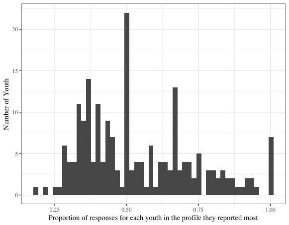

# Results

```{r, setup-results, include =FALSE}
knitr::opts_chunk$set(echo = FALSE,
                      message = FALSE,
                      warning = FALSE,
                      collapse = TRUE,
                      error = TRUE,
                      fig.width = 6,
                      fig.asp = .618,
                      out.width = "80%",
                      fig.align = "center",
                      results = "hold",
                      knitr.kable.na = '')

source("04-results.R")
```

In this section, results associated with the preliminary analysis and the four research questions are presented. 

## Preliminary results

### Descriptive statistics for the engagement measures

First, descriptive statistics for the engagement measures (the five variables that were used to estimate the profiles) are presented in Table 5. These values suggest moderately high levels of the three dimensions of engagement (with mean values between 2.768 (*SD* = 1.063) for cognitive engagement, and 2.863 (*SD* = 1.044), for behavioral engagement, on one-four scales) and high perceptions of competence (*M* = 3.000 (*SD* = 0.952)); the only continuous variable that was not measured using ESM) and lower perceptions of challenge (*M* = 2.270 (*SD* = 1.117)).

```{r}
oo <- d_red %>% 
  select(dm_cog_eng,
         dm_beh_eng,
         dm_aff_eng,
         dm_challenge,
         dm_competence) %>% 
  psych::describe(.) %>% 
  as.data.frame() %>% 
  tibble::rownames_to_column("var") %>% 
  select(var, n, mean, sd) %>% 
  mutate(var = c("Cog. eng.",
                 "Beh. eng.",
                 "Aff. eng.",
                 "Challenge", 
                 "Competence"))

names(oo) <- c("", "n", "Mean", "SD")

oo %>% 
  knitr::kable(format = "latex", booktabs = TRUE, caption = "Descriptive statistics for study variables", linesep = "", digits = 3)
```

### Correlations among the study variables

Next, correlations between the variables that are used to create the profiles are presented in Table 6. These correlations among the variables used to construct the profiles, which range from *r* = .08 through *r* = .60 (all statistically significant), show moderate relations.

<!-- Pre-interest was correlated with the variables used to construct the profiles to a small degree (with *r* values ranging between .06 and .14). -->

```{r}
p <- d_red %>%
  select(overall_pre_interest, dm_cog_eng:dm_competence) %>%
  corrr::correlate() %>%
  corrr::shave() %>%
  corrr::fashion() %>% 
  mutate(rowname = c("Pre-interest",
                     "Cog. eng.",
                     "Beh. eng.",
                     "Aff. eng.",
                     "Challenge", 
                     "Competence"))

names(p) <- c("",
              "Pre-interest",
              "Cog. eng.",
              "Beh. eng.",
              "Aff. eng.",
              "Challenge", 
              "Competence")

p %>% 
  knitr::kable(booktabs = TRUE, format = "latex", linesep = "", caption = "Correlations among study variables") %>%
  kableExtra::landscape()
```

## Results for Research Question #1

### Frequency of work with data

Of the 236 instructional episodes, 170 (72%) were coded as involving *any* of the aspects of work with data. Table 7 includes the frequency of the specific aspects of work with data, with interpreting and communicating findings being the most present (occurring in 47% of the coded instructional episodes), followed by generating data (in 45% of the instructional episodes), asking questions (in 39%), data modeling (29%), and then making observations (26%).

```{r, eval = T}
data_frame(`Aspect of Work With Data` = c("Asking Questions", "Making Observations", "Generating Data", "Data Modeling", "Communicating Findings"),
           Proportion = c(.389, .258, .453, .288, .470),
           N = c(92, 61, 107, 68, 111)) %>%
  knitr::kable(booktabs = TRUE, linesep = "", caption = "Proportion of signals for which each of the aspects of work with data was present")

```

Note that these results are for codes applied to approximately ten-minute (video-recorded) instructional episodes and that the aspects of work with data could co-occur. On average, there were 1.86 (*SD* = 1.61) aspects of work with data present in each 10-minute instructional episode. This indicates that, on average, youth were engaged in around two of aspects of the work with data during each instructional episode. There was considerable variation in the extent to which these types of work with data were supported in each program (see the Appendix).

### Nature of work with data

For these results, the different aspects of work with data were looked at in more detail using an open-ended, qualitative approach in order to better understand the nuance and the specific nature of what was going on during these episodes in terms of how students work with data. This coding, which showed there to be distinct, qualitative differences in the particular ways youth worked with data when, for example, they were data modeling, resulted in approximately three to four sentence notes from each of two raters for every instructional episode and showed the specific nature of work with data. 

#### Asking questions or identifying problems

Among the instructional episodes that included the asking questions aspect of work with data (as determined through coding with the STEM-PQA measure), creating qualitative descriptions revealed that around one-third (36/92, or 39%) were focused on asking questions focused on youth working to understand the phenomenon or problem they were investigating. For example, in an instructional episode during the *Ecosphere* program in which youth constructed inclined tables to study how water moved throughout the ecosystem, the youth activity leader prompted youth to generate hypotheses of what would happen when water was poured onto the table, before pouring the water. Other instructional episodes involved questions that were not focused on predicting, conjecturing, or hypothesizing. In such cases, the code was applied to instances in which the youth were asking generic questions (i.e., about how they do an assignment) or when the instructor was asking youth questions (i.e., math-related questions). For example, in the *Marine Investigators* program, youth visited a water treatment site, and were provided opportunities to ask questions about what they observed.

#### Making observations

In the instructional episodes during which the STEM-PQA revealed that youth were making observations, the vast majority (49/57, 86%) of these were focused on observing phenomenon in the field, or, in the case of engineering-focused programs, noticing what was going on with a particular design. For example, in the *Building Mania* program, youth constructed Rube Goldberg machines; youth were prompted by the activity leaders to notice how changes in their design led to differences in how far objects were launched or rolled. In just a few cases, making observations was focused on making observations not of phenomena, but of the instructor. For example, in the *Adventures in Mathematics* program, instances in which youth observed other youth or the youth activity leader solving a mathematics problem was often coded as involving making observations. 

#### Generating data

Around half (48/102, or 47%) of these episodes, for youth generating sources of data (as indicated by the STEM-PQA), the instructional episodes were focused around writing down observations made of a phenomenon, recording information from experiments, or recording the results of a trial (in engineering contexts). For example, in the *Marine Investigators* program, youth collected pieces of recyclable plastic, bringing them back to the classroom and counting them for each location they were collected. The other half of the cases were most often instructional episodes in which youth were writing down what the youth activity leader was saying or were focused on collecting specimens (but not writing them down) entering them into a spreadsheet, or otherwise recording them as data. For example, again in the *Marine Investigators* program, youth used nets to collect saltwater organisms, which they then transported in buckets back to the classroom setting for subsequent analysis. While these specimens could be considered as data, at least in the instructional episode described, youth did not inscribe notes or any other observations on the specimens they were collecting, and so data was not generated (at this stage).

#### Data modeling

A large majority (49/68, 72%) of the instructional episodes coded (with the STEM-PQA) for data modeling were focused on youths' uses of statistical and mathematical models. For example, in the *Comunidad de Aprendizaje* program, youth accessed nationally-representative data and were tasked to solve problems, like finding out what percentage of people engage in particular activities, like donating to charity. In a small number of instructional episodes, this aspect of work with data was present when the youth activity leader, rather than students, was doing the modeling, or the model was not one that could generate data. For example, in the *Marine Investigators* program, a youth activity leader used a plush toy seal designed to teach youth about anatomy and the dangers of aquatic mammals consuming trash and recyclables.

#### Interpreting and communicating findings

In around half (49/103, 48%) of the instructional episodes in which youth were interpreting and communicating findings (as coded by the STEM-PQA), youth were sharing what they found from an investigation or the results of using the product they designed. For example, in the *Comunidad de Aprendizaje* program, youth participated in an activity designed to support their thinking about creating a product to bring to market; the youth activity leaders described this as being akin to the television show the *Shark Tank*. In one instructional episode, the youth activity leader asks youth to think of an idea that would make an investor willing to invest in; students shared their ideas, describing what their ideas was, why it was a good idea, how much they could sell it for, and what their profit would be, while fielding questions from youth activity leaders and their peers. Interpreting and communicating findings was also commonly present in instructional episodes in which youth were debating the findings of an investigation, such as the results of calculations for the amount of recyclables entering waterways (in *Marine Investigators*). In the other half of the responses, youth were most commonly communicating about topics other than the results of an investigation or design process, such as trying to find out the answer to a question posed by the youth activity leader, or the youth activity leader was who was doing the interpreting and communicating. For example, in the *Adventures in Mathematics* program, the youth activity leader helped youth to solve problems on a worksheet, asking guiding questions to help youth start to solve problems on their own. 

## Results for Research Question #2: What profiles of youth engagement and its conditions emerge from experiential data collected in the programs?

A relatively simple model (model *one* type; with varying means, equal variances, and covariances fixed to 0) with six profiles was selected for use in subsequent analyses. This model has profiles characterized by both varying levels on both the dimensions of engagement--cognitive, behavioral, and affective--and youths' perceptions of challenge and competence. In addition, the number of observations across the profiles is relatively balanced. 

This means that *six distinct profiles* were identified in the data. This selection was on the basis of fit statistics, statistical tests, and concerns of interpretability and parsimony. The solution demonstrated superior fit on the basis of the information criteria (AIC and BIC) and on the basis of the measure of classification accuracy (entropy). Note that a seven profile solution with the same specifications regarding means, variances and covariances was also a similarly good fit (and is presented in the Appendix), but the 6 profile solution was ultimately chosen on the basis of parsimony and interpretability. 

For the six profiles, presented below in Figure 3, the *first* plot shows the profiles with variables that were centered to have a mean equal to 0 and a standard deviation of 1. Thus, the y-axis for this plot is labeled "Z-score"). The *second* plot shows the profiles with the raw data (not transformed). Thus, the *y*-axis for this plot is labeled "Value."

```{r, fig.width = 7, fig.asp = .618, out.width = "100%"}

m1_6 <- read_rds("data/models/m1_6.rds")

p1 <- m1_6 %>%
  plot_profiles_mplus(to_center = TRUE, to_scale = TRUE) +
  scale_x_discrete("", 
                   limits = c("Profile 2 (n = 667)",
                              "Profile 1 (n = 370)",
                              "Profile 4 (n = 345)",
                              "Profile 5 (n = 638)",
                              "Profile 3 (n = 450)",
                              "Profile 6 (n = 488)"),
                   labels = c("Universally low (n = 667)",
                              "Only behavioral (n = 370)",
                              "Only affective (n = 345)",
                              "All moderate (n = 638)",
                              "Engaged and competent but not challenged (n = 450)",
                              "Full (n = 488)")) +
  xlab(NULL) +
  ylab("Z-score") +
  viridis::scale_fill_viridis("",
                              limits = c("DM_AFF_E", "DM_BEH_E", "DM_COG_E", "DM_CHALL", "DM_COMPE"),
                              labels = c("Affective", "Behavioral", "Cognitive", "Challenge", "Competence"), discrete = TRUE) +
  theme(plot.margin = margin(1, 0, 0, 1, "cm"))

m1_6 <- read_rds("data/models/m1_6.rds")

p2 <- m1_6 %>%
  plot_profiles_mplus(to_center = FALSE, to_scale = FALSE) +
  scale_x_discrete("", 
                   limits = c("Profile 2 (n = 667)",
                              "Profile 1 (n = 370)",
                              "Profile 4 (n = 345)",
                              "Profile 5 (n = 638)",
                              "Profile 3 (n = 450)",
                              "Profile 6 (n = 488)"),
                   labels = c("Universally low (n = 667)",
                              "Only behavioral (n = 370)",
                              "Only affective (n = 345)",
                              "All moderate (n = 638)",
                              "Engaged and competent but not challenged (n = 450)",
                              "Full (n = 488)")) +
  xlab(NULL) +
  ylab("Value") +
  viridis::scale_fill_viridis("",
                              limits = c("DM_AFF_E", "DM_BEH_E", "DM_COG_E", "DM_CHALL", "DM_COMPE"),
                              labels = c("Affective", "Behavioral", "Cognitive", "Challenge", "Competence"), discrete = TRUE) +
  theme(plot.margin = margin(1, 0, 0, 1, "cm")) +
  coord_cartesian(ylim = c(1, 4))

```

This solution is characterized by:

- A *universally low* profile, characterized by low levels of engagement and challenge and competence
- An *only behaviorally engaged* profile, with moderate levels of behavioral engagement, very low affective engagement, and moderately (low) levels of cognitive engagement and challenge and competence
- An *only affectively engaged* profile, with moderate levels of affective engagement, low levels of behavioral engagement, and moderately (low) levels of cognitive engagement and challenge and competence
- A *all moderate* profile, with moderate levels of the three dimensions of engagement and challenge and competence
- An *engaged and competent but not challenged* profile, characterized by high levels of each of the three dimensions of engagement and of competence, but with low levels of challenge
- A *full* profile, with high levels of engagement, challenge, and competence

The number of observations associated with each of the profiles is somewhat balanced, with the universally low profile with the largest number of observations (*n* = 667), followed by the all moderate profile (*n* = 638). Each of the other four profiles were associated with 300 to 400 observations. 

### Sources of variability in profiles of engagement

The remaining analyses use the six profiles described above. Sources of variability in these profiles can be used as additional information in their own right for interpreting the profiles and in order to anticipate the effects of predictor variables at the youth, instructional episode, and program levels. 

First, the proportion of the variability at each of these levels is explored through the use of null, or variance components, in Table 4.3. Again, these are models that only include grouping (i.e., the variable identifying which youth a response is from, what signal the response is associated with, and from which program the youth and signal were from) factors. These models provide insight into at which of these "levels" predictors may be able to explain the outcome. For all six profiles, the ICCs at the program level were very small, from 0.00 to 0.023. This suggests that very little variability can be explained simply by the program. For the instructional episode level, the ICCs were also very small, ranging from 0.004 to 0.011. Finally, the youth-level ICCs ranged from .099 to .427. 

```{r}
i <- read_rds("data/m1-6.rds") 

ii <- i %>% 
  select(beep_ID_ICC:program_ID_ICC)

names(ii) <- c("Instructional Episode", "Youth", "Program")

ii %>% 
  knitr::kable(format = "latex", booktabs = TRUE, caption = "Intra-class correlation (ICC) values for each of the three levels", linesep = "") %>%
  kableExtra::landscape()
```

Looking across these values, most of the explained variability in the responses is associated with youth; the program and instructional episode levels were associated with very small values, suggesting that variables at these levels have minimal variability to explain. In turn, this suggests that these variables, including those for work with data, may not have strong effects in terms of their relations with the profiles.

In terms of specific ICCs at the youth level, the value for the youth-level ICC was highest for the *Full* profile (*ICC* = .432), suggesting that some youth have a strong tendency to be fully engaged (possibly due to their initial interest or other individual characteristics and differences). The other profile characterized by a consistent pattern across all of the variables--the *Universally low* profile--had a modest value (*ICC* = .265). Finally, a large amount of variability is associated with the residual (variance that is not associated with the program, instructional episode, or youth levels). This suggests that there is wide variation in students' responses that may not be readily explained or predicted by variables *at one level alone*. Remaining unexplained variability is the product of youth, instructional episode, and program effects together. Some youth from particular programs may engage during some episode instructional episodes in very high or low ways that are not captured by modeling the variability at each of these levels alone.

Variability in terms of the number (and proportion) of profiles each youth reports can also be considered. When the breakdown of responses in each of the six profiles by youth is explored: As presented in Figure X, the value of the mean for the proportion of responses for each youth in the profile they reported most was .540 (*SD* = .194, *min* = .182, *max* = 1.00). This indicates that on average youths' most reported profile comprises just over one-half of their responses, with substantial variability in their responses. Apart from this overall mean proportion, the mean proportion for specific profiles can be considered. For example, when *Full* engagement was reported by a youth more than any other profile, they reported it, on average, in just over 60% of their responses. No other profile that youth reported most was associated (on average) with a larger proportion of their responses. This suggests that even when youth report (relatively) stable engagement over the course of their time in the programs, they still engage in a variety of different ways. When youth reported *All moderate* engagement (the profile with the lowest proportion of responses, on average, when reported more than any other), they reported it in just less than 40% of their responses. This suggests that though youth may report one profile far more than others--and that youth who report particular (i.e., *Full*) profiles more than others may reflect somewhat stable engagement, there still exists substantial variability in youths' engagement.

```{r, fig.cap = "Histogram of the proportion of responses for each youth in the profile they reported most"}

```

<!-- the substantial variability in how youth are engaging becomes evident -->

<!-- hat about explaining that if we try to characterize persons in terms of what their most frequently observed profile is, the ‘most frequent’ is not the vast majority -then give examples, that the most ‘stable’ is only 60%, which means in 40% of cases, they are engaging in some other way.  -->

<!-- These show that there is substantial variability between youth, in that, when youth, for example, report *Full* engagement to a greater extent than any other profile of engagement, these youth (on average) report this engagement in just over 60% of their responses. Their other responses were (on average) associated with a mixture of other profiles. Youth who report more *Full* engagement than any other profile of engagement are the most consistent in reporting one of the profiles of engagement, with youth reporting engagement associated with the *All moderate* profile doing so just less than 40% of the time (with other profiles being associated with the remainder of their responses). -->

## Results for Research Question #3: Aspects of work with data and engagement

The results for this and the next research question are presented in Table 4.5. In this table, each column represent the output from one of the six different models. For example, the first column includes the results for the model with the probability of a response being associated with the *Only behavioral* profile as the dependent variable. The cells down the rows contain the coefficients (and their standard errors and (*p*-values)) for each of the predictor variables. 

Only the coefficients associated with the aspects of work with data are interpreted in this section in order to provide results for this research question, because the youth characteristics are interpreted for research question #4. As described earlier, the results were practically the same for these sets of predictors being included in either separate or the same model, so they are included in the same model. 

See the Appendix for the results from the model with the aspects of work with data included as predictors in separate (without the youth characteristics) models. Note that there were only significant relations with the *Full* profile (see the column with the column name *Full* for these results). The only relations that were statistically significant were for the relations between modeling data and the *Full* profile ($\beta$ = 0.034 (0.017), *p* = .020) and between generating data and the *Full* profile ($\beta$ = 0.027 (0.015), *p* = .033): When youth were either modeling or generating data, they were more likely to be fully engaged.

After finding there to be few relations between the aspects of work with data and engagement, sensitivity analysis for the statistical significant effects was carried out. This revealed that the effect of modeling data on *Full* engagement was more robust than that for generating data (also upon *Full* engagement): 9.835% of the effect of modeling would have to be due to bias to invalidate the inference about its effect, whereas only 1.884% of the effect of generating data would need to be due to bias to invalidate the inference about its effect. Further explanations and investigations of these effects are the focus on research question #4 (in terms of the effect of youth characteristics) and are discussed in the next chapter.

```{r, eval = T}
o <- read_rds("data/m1d-6d.rds")
o <- mutate(o, model = c(
  str_c("profile_", 1:6)))

oo <- o %>%
  select(model,
         intercept = `(Intercept)`,
         overall_pre_interest,
         gender_female,
         urm,
         dm_ask, dm_obs, dm_gen, dm_mod, dm_com
  ) %>%
  mutate(model = c("Only behavioral",
                   "Universally low",
                   "Engaged and competent but not challenged",
                   "Only affective",
                   "All moderate",
                   "Full"),
         the_order = c(2, 1, 3, 5, 3, 6)) %>% 
  arrange(the_order) %>%
  select(-the_order)

names(oo) <- c("Profile", "Intercept", "Pre-interest", "Gender-Female", "URM status", "Asking", "Observing", "Generating", "Modeling", "Communicating")

oo %>% 
  t() %>% 
  knitr::kable(format = "latex", booktabs = TRUE, caption = "Results of mixed effects models with the interactions between interest and other characactistics and the composite for work with data", linesep = "") %>%
  kableExtra::kable_styling(latex_options = "scale_down") %>%
  kableExtra::landscape() 
```

## Results for Research Question #4: Youth characteristics and engagement

Like for the results for research question #3, each column is associated with the results for a single model, again in Table 4.5. For example, the first row is again associated with the results for the model predicting the probability of the *Only behavioral* profile, with the cells across the columns containing the coefficients, their standard errors, and their *p*-values. These results show that overall pre-interest is associated with the *Engaged and competent but not challenged* profile ($\beta$ = 0.039 (0.016), *p* = .009). For this effect, 17.879% would be needed to invalidate the inference, suggesting a moderately robust effect. The effect of being a female was not statistically significant but has a relation of 0.060 (0.037, *p* = .051) upon the probability of a response being associated with the *Universally low* profile. For the effect of gender upon the *Universally low* profile, 17.843% of the bias would need to be removed (or the effect would need to be larger by this percentage) to sustain the inference. 

These few, small findings were more surprising than the similarly minimal relations observed for work with data: as the null models indicate, there were large ICCs (a large proportion of the variability in the outcome variables) at the youth-level (as pre-interest, gender, and URM status were variables associated with this level). However it appears that the youth level variables of interest to this study were not effective at explaining much of this variability. This is discussed further in the next chapter.
